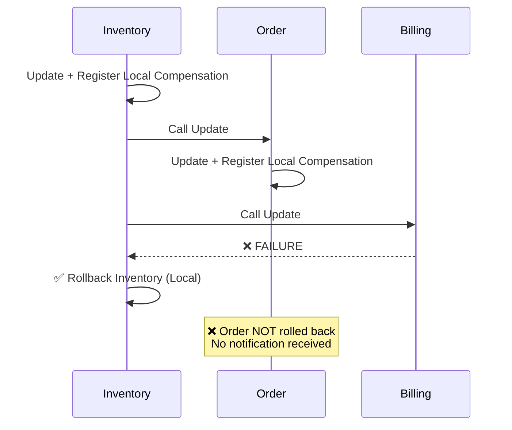
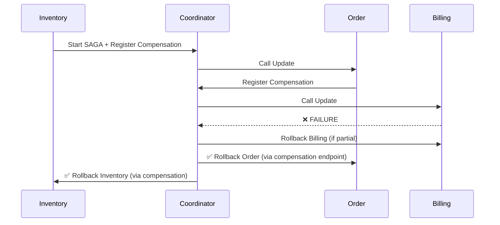

# Enhanced SAGA Coordinator Solution

## Problem Statement Solved

Your original concern was:
> "Issue is coming when billing got failed then it came back to inventory, inventory got rolled back but order remains as it is because how would order service know that billing got failed and it has to roll back the compensation step it registers because it will never get to order again if billing failed."

## Solution Overview

The **Centralized SAGA Coordinator** approach solves this by:

1. **Single Point of Control**: All service operations and compensations are managed centrally
2. **Complete Rollback Chain**: When any service fails, ALL previous services are automatically rolled back
3. **No Code Duplication**: Standardized pattern across all services
4. **Scalable Design**: Easily supports 5+ services in complex flows

## Architecture Components Created

### Core SAGA Framework Enhancements

- **`SagaCoordinatorService`**: Central orchestration and rollback management
- **`DistributedSagaContext`**: Shared context across all services  
- **`ServiceStepRegistry`**: Tracks compensation steps for all services
- **`ServiceCompensationStep`**: Unified compensation step representation
- **`SagaStepRegistrar`**: Utility for easy step registration

### Service Integration

- **`CompensationEndpoint`**: Standardized interface for all services
- **Enhanced Controllers**: Added `/compensate/*` endpoints to all services
- **Compensation Methods**: Dedicated rollback methods in each service

## How It Solves Your Problem

### Before (Current Issue)


### After (Coordinator Solution)


## Demonstration Endpoints

### 1. Current Flow-2 (With Issue)
```bash
# This demonstrates the current problem
PUT /inventory/update-flow2?ItemId=1&qty=10
```

### 2. Enhanced Flow (Solution)
```bash
# This demonstrates the coordinator solution
PUT /inventory/update-enhanced?ItemId=1&qty=10
```

### 3. Failure Simulation
```bash
# Simulate billing failure to test rollback
POST /billing/compensate/simulate-failure?sagaId=test123&inventoryId=1
```

## Testing the Solution

### Test Case 1: Normal Flow Success
```bash
# 1. Create inventory item first
POST /inventory/create-flow2

# 2. Test enhanced update (should succeed)
PUT /inventory/update-enhanced?ItemId=1&qty=15
```

### Test Case 2: Billing Failure Rollback
```bash
# 1. Create inventory item
POST /inventory/create-flow2

# 2. Test update with billing failure
# (Mock billing service to fail)
PUT /inventory/update-enhanced?ItemId=1&qty=20
```

## Key Benefits Achieved

### 1. **Complete Rollback Chain**
- ✅ When billing fails, **ALL** services roll back
- ✅ No orphaned data across services
- ✅ Consistent state maintained

### 2. **Centralized Control**
- ✅ Single coordinator manages all rollbacks
- ✅ Clear visibility into SAGA status
- ✅ Standardized error handling

### 3. **No Code Duplication**
- ✅ Reusable coordinator across all SAGAs
- ✅ Standardized compensation interface
- ✅ Consistent pattern for new services

### 4. **Scalability**
- ✅ Easy to add new services (Order → Payment → Shipping → Notification)
- ✅ Complex flows supported (Service1 → Service2 → Service1 → Service3)
- ✅ Priority-based rollback ordering

## Monitoring and Management

### Coordinator Endpoints
```bash
# View active SAGAs
GET /saga/coordinator/active

# Check specific SAGA status  
GET /saga/coordinator/status/{sagaId}

# Manual rollback trigger
POST /saga/coordinator/rollback/{sagaId}

# Health check
GET /saga/coordinator/health
```

### Service Compensation Health
```bash
# Check compensation health
GET /orders/compensate/health
GET /billing/compensate/health
```

## Future Enhancements

### Phase 1: Current Implementation
- ✅ Centralized coordinator with step registry
- ✅ Standardized compensation endpoints
- ✅ Enhanced inventory service with coordinator integration
- ✅ Order and billing service compensation methods

### Phase 2: Advanced Features (Future)
- 🔄 Persistent SAGA state storage
- 🔄 Retry mechanisms for failed compensations  
- 🔄 SAGA execution timeout handling
- 🔄 Distributed coordinator (multiple instances)
- 🔄 Event-driven notifications for monitoring

## Code Structure

```
core-saga/
├── coordinator/
│   ├── SagaCoordinatorService.java      # Main coordinator
│   ├── DistributedSagaContext.java      # Shared context
│   ├── ServiceStepRegistry.java         # Step tracking
│   └── CompensationEndpoint.java        # Interface
├── enhanced/
│   └── DistributedSaga.java            # Enhanced utilities
└── aop/
    └── SagaAspect.java                  # Enhanced aspect

services/
├── inventory-service/
│   └── EnhancedInventoryOrchestrationService.java
├── order-service/
│   └── OrderCompensationController.java
└── billing-service/
    └── BillingCompensationController.java
```

## Summary

The **Centralized SAGA Coordinator** approach completely solves your compensation issue:

1. **Root Cause Addressed**: Order service now gets properly notified and rolled back when billing fails
2. **Scalable Solution**: Works for any number of services in any order
3. **Centralized Management**: Single point of control for all rollbacks
4. **Future-Proof**: Easy to extend for complex multi-service flows

The solution maintains your orchestration pattern while ensuring **complete rollback chain execution** across all participating services.